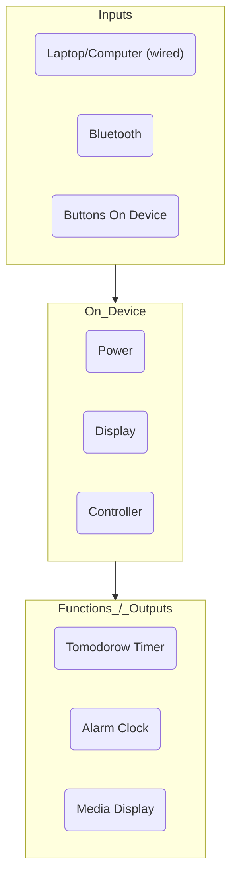

Architecture Diagram
Subgraphs are denoted in notes with their own Notes (Denoted Below)
This note is only for overarching goals/requirments

```mermaid
flowchart TD
	subgraph Inputs
	I1("`Laptop/Computer (wired)`")
	I2(Bluetooth)
	I3(Buttons On Device)
	end
	
	subgraph On_Device
	D1(Power)
	D2(Display)
	D3(Controller)
	end
	
	subgraph Functions_/_Outputs
	FO1(Tomodorow Timer)
	FO2(Alarm Clock)
	FO3(Media Display)
	end
	
	Inputs --> On_Device --> Functions_/_Outputs
```
[[Inputs]]
[[On Device]]
[[Outputs]]
