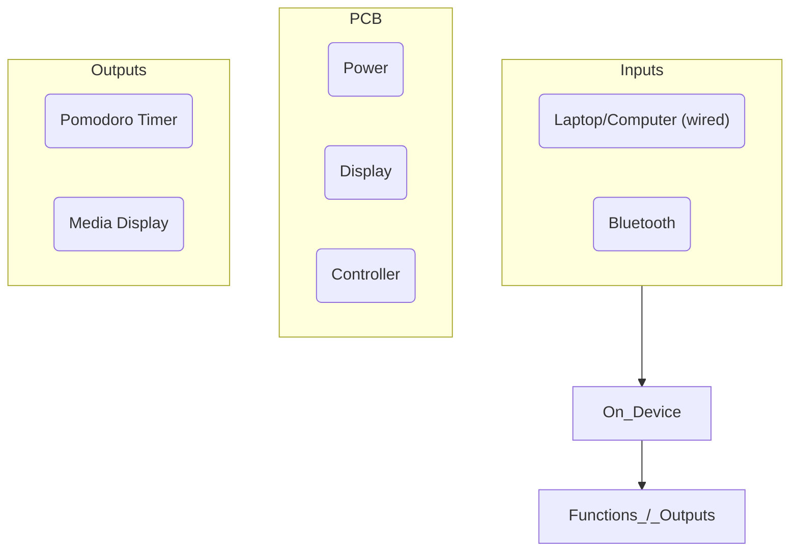

# Desk Clock Timer

Compact STM32-controlled Bluetooth desk clock powered over USB-C with a [4200 mAh lithium battery](https://www.amazon.ca/4200mah-Rechargeable-Lithium-Replacement-Electronic/dp/B095BP7V1D?th=1) for portability. It connects to Windows/Linux over USB and Bluetooth for time sync, alarm setup, and media data, and drives a [Waveshare Pico-ePaper 7.5](https://www.waveshare.com/pico-epaper-7.5.htm) E-ink display to show the clock, Pomodoro timer, and live Spotify/media information.

> Assembly and firmware are in progress. Images coming soon.

## Architecture

## Hardware Design Notes

### 2.4 GHz Antenna

The board uses a **meander PCB antenna** for the 2.4 GHz Bluetooth link. The antenna is designed to 
present a **50 ohms** impedance directly to the feedline, so the transceiver sees a clean match across 
the 2400–2480 MHz operating band.

### RF Signal Routing & Integrity

- The RF trace is routed as a **coplanar waveguide with ground plane (CPWG)**, with the
  reference ground on the layer directly beneath the trace to keep the characteristic
  impedance controlled at 50 ohms.
- **Shielding (stitching) vias** are placed along the RF trace to stitch the top-side ground
  pour to the inner ground plane. These vias form a cage around the trace that reduces
  coupling and keeps the impedance consistent along the run.
- The antenna keep-out zone is clear of copper pours and ground planes to avoid detuning the
  radiator.

### E-Ink Boost Converter

The 7.5" Pico-ePaper display requires a higher drive voltage than the 3.3 V rail. A **boost
converter** steps the battery/rail voltage up to the display's operating level. The boost
switching node and inductor loop are kept tight, short and away from the RF traces to minimize 
EMI and switching losses.

### USB-C Differential Pair

The USB connection is routed as a **90-ohm differential pair** for the D+/D− signals, keeping
the pair tightly coupled and length-matched to preserve signal integrity across the USB-C
connection.

## Altium Project

Schematics, layout, and fabrication outputs live in the [`altium/`](altium) folder.
The full schematic set is exported to [`Desk-Clock-Timer.pdf`](altium/Desk-Clock-Timer.pdf), and Gerber/drill files are available under `Project Outputs for Desk-Clock-Timer`.
