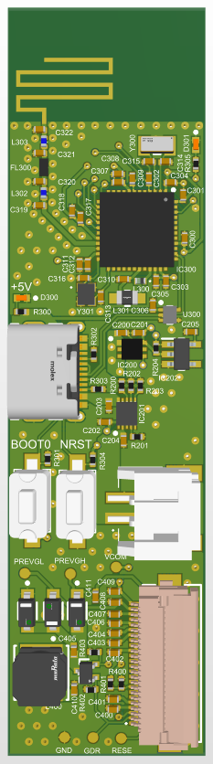
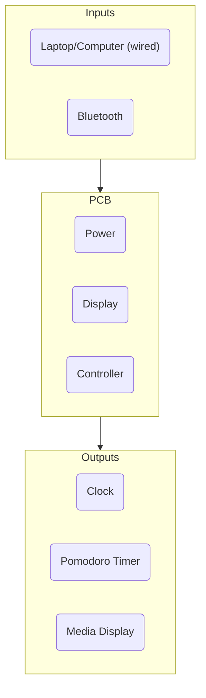

# Desk Clock Timer

Compact STM32-controlled Bluetooth desk clock powered over USB-C with a [4200 mAh lithium battery](https://www.amazon.ca/4200mah-Rechargeable-Lithium-Replacement-Electronic/dp/B095BP7V1D?th=1) for portability. It connects to Windows/Linux over USB and Bluetooth Low Energy (BLE) for time sync, alarm setup, and media data, and drives a [7.5 inch E-ink display](https://www.waveshare.com/product/7.5inch-e-paper-b.htm) to show the clock, Pomodoro timer, and live Spotify/media information.

 

  
  

 

Soldering the flat flexible cable connector for display was difficult and a few pads were unfortunately destroyed. Everything will be resoldered on a spare PCB in the near future.

## Status

> Firmware is in progress.

- **Bluetooth Low Energy:** Tested and working. The board advertises as `DCLKTIM` and is discoverable in [nRF Connect](https://www.nordicsemi.com/Products/Development-tools/nRF-Connect-for-Desktop).
- **LED control over BLE:** Working. Writing to the P2P Server characteristic toggles the blue user LED. The payload is one byte:
  - `0x01` → LED on
  - `0x00` → LED off
- **Display & battery:** Not yet tested. The 7.5" E-ink display and the 4200 mAh Li-ion battery have **not** been purchased yet since they were pretty expensive. Planning to get them soon.

## Next Steps

1. Purchase the 7.5" E-ink display and the 4200 mAh Li-ion battery.
2. Wire up and validate the E-ink boost converter (~22 V drive rail) and render the clock/Pomodoro/media UI.
3. Validate USB-C charging and battery behavior.
4. Expand the BLE service beyond the LED demo (time sync, alarm setup, media data).
5. Add enclosure / mechanical design.

## Architecture

## Hardware Design Notes

### Layer Stack-Up

The board is 2-layers. Routing is split between the two layers and the empty space is filled with a 
GND pour.

### 2.4 GHz Antenna

The board uses a meander PCB antenna for the 2.4 GHz Bluetooth link. The antenna is designed to 
present a 50 ohm impedance directly to the feedline, so the transceiver sees a clean match across 
the 2400–2480 MHz operating band.

### RF Signal Routing & Integrity

- The RF trace is routed as a coplanar waveguide, with the
  reference ground on the layer directly beneath the trace to maintain the 50 ohm characteristic
  impedance.
- Shielding vias are placed along the RF trace to stitch the top-side ground
  pour to the inner ground plane. These vias form a cage around the trace that reduces
  coupling and keeps the impedance consistent along the run.
- The antenna keep-out zone is clear of copper pours and ground planes to avoid detuning.

### E-Ink Boost Converter

The E-ink display requires a higher drive voltage than the 3.3 V rail. A boost
converter steps the battery/rail voltage up to the display's operating level or about 22V. The boost
switching node and inductor loop are kept tight, short and away from the RF traces to minimize 
EMI and switching losses.

### USB-C Differential Pair

- USB connection is routed as a 90-ohm differential pair for the D+/D− signals. It is length matched 
and tightly coupled
- USB D+/D− data lines are protected against electrostatic discharge with a TVS diode array
  placed to clamp ESD transients before they reach the transceiver.

## Altium Project

Schematics, layout, and fabrication outputs live in the [`altium/`](altium) folder.
The full schematic set is exported to [`Desk-Clock-Timer.pdf`](altium/Desk-Clock-Timer.pdf), and Gerber/drill files are available under `Project Outputs for Desk-Clock-Timer`.

## Firmware

The controller is an **STM32WB35CCU6A**, a dual-core part: the application runs on the Cortex-M4
(CPU1) and the Bluetooth radio is a prebuilt stack that runs on the Cortex-M0+ (CPU2). The application
alone is not enough — CPU2 must be loaded with the wireless coprocessor firmware before anything
advertises.

### Prerequisites

- [STM32CubeProgrammer](https://www.st.com/en/development-tools/stm32cubeprog.html) — used to flash the
  coprocessor firmware and the application.
- [STM32CubeWB](https://www.st.com/en/embedded-software/stm32cubewb.html) — the STM32WB firmware
  package. The coprocessor binaries live under
  `Projects/STM32WB_Copro_Wireless_Binaries/` after unpacking:
  - `stm32wb3x_FUS_fw.bin` — the FUS (Firmware Upgrade Service) for CPU2.
  - `stm32wb3x_BLE_Stack_fw.bin` — the BLE wireless stack for CPU2.

### One-time coprocessor setup

1. Put the board into DFU mode: **hold the BOOT0 button, press and release RESET, then release BOOT0.**
   This boots the STM32 system bootloader so STM32CubeProgrammer can detect the device over USB.
2. Open STM32CubeProgrammer and connect over **USB**.
3. Flash the **FUS** firmware (`stm32wb3x_FUS_fw.bin`) via the Firmware Upgrade view.
4. Flash the **BLE stack** (`stm32wb3x_BLE_Stack_fw.bin`) the same way.
5. **Activate / start the RF stack** so CPU2 actually runs (the stack can be installed but left stopped;
   it must be started or the device will never advertise).
6. Power-cycle the board. It now boots from flash normally and CPU2 runs the BLE stack.

### Flashing the application

- After the coprocessor firmware is in place, flash **only the application** (the `.elf`/`.bin` built
  from `firmware/DCLKTIM_BLE`).
- **Do not perform a full-chip erase** — that wipes the BLE stack region on CPU2 and the device goes
  silent again. Use "erase only necessary sectors" / program without erase, then reset.

The BLE demo in `firmware/DCLKTIM_BLE/BLE_p2pServer` advertises as `DCLKTIM` and toggles the blue user
LED from the P2P Server characteristic (see [Status](#status)).
