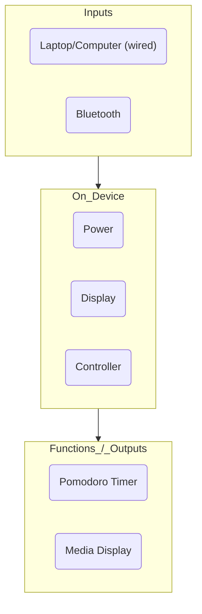

# Desk Clock Timer

Compact STM32-controlled Bluetooth desk clock powered over USB-C with a [4200 mAh lithium battery](https://www.amazon.ca/4200mah-Rechargeable-Lithium-Replacement-Electronic/dp/B095BP7V1D?th=1) for portability. It connects to Windows/Linux over USB and Bluetooth for time sync, alarm setup, and media data, and drives a [Waveshare Pico-ePaper 7.5](https://www.waveshare.com/pico-epaper-7.5.htm) E-ink display to show the clock, Pomodoro timer, and live Spotify/media information.

> Assembly and firmware are in progress. Images coming soon.

## Architecture

## Altium Project

Schematics, layout, and fabrication outputs live in the [`altium/`](altium) folder.
The full schematic set is exported to [`Desk-Clock-Timer.pdf`](altium/Desk-Clock-Timer.pdf), and Gerber/drill files are available under `Project Outputs for Desk-Clock-Timer`.
